# 🗺️ Roadmap CRM системы BotDev Studio

> Полный обзор текущих функций и сценариев использования для администраторов и исполнителей

---

## 📋 Содержание

1. [Архитектура системы](#архитектура-системы)
2. [Роли пользователей](#роли-пользователей)
3. [Сценарии для главного администратора](#сценарии-для-главного-администратора)
4. [Сценарии для исполнителей](#сценарии-для-исполнителей)
5. [Telegram Bot для клиентов](#telegram-bot-для-клиентов)
6. [Mini App для клиентов](#mini-app-для-клиентов)
7. [Основные разделы Admin Panel](#основные-разделы-admin-panel)

---

## Архитектура системы

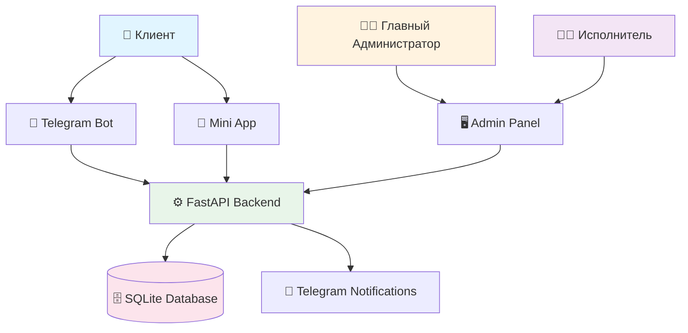

---

## Роли пользователей

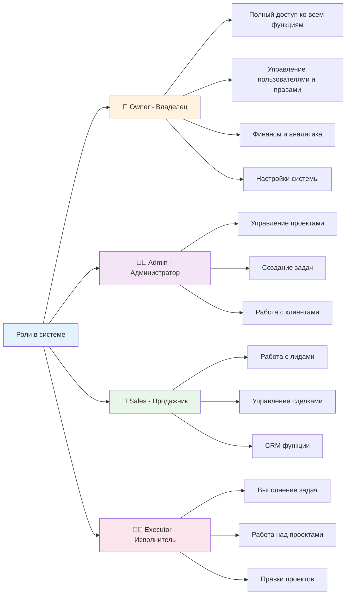

---

## Сценарии для главного администратора

### 1. 📊 Управление проектами

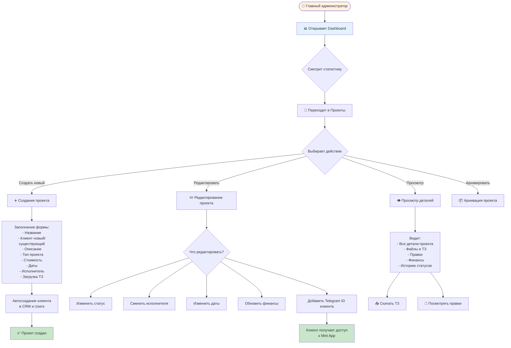

### 2. ✅ Управление задачами для исполнителей

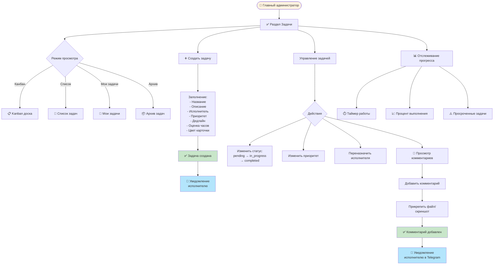

### 3. 👥 Управление клиентами и CRM

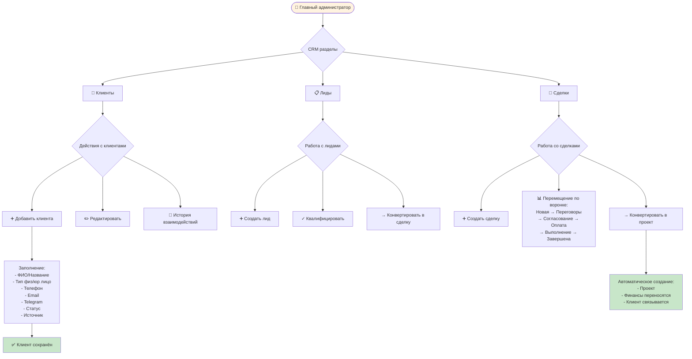

### 4. 💰 Управление финансами

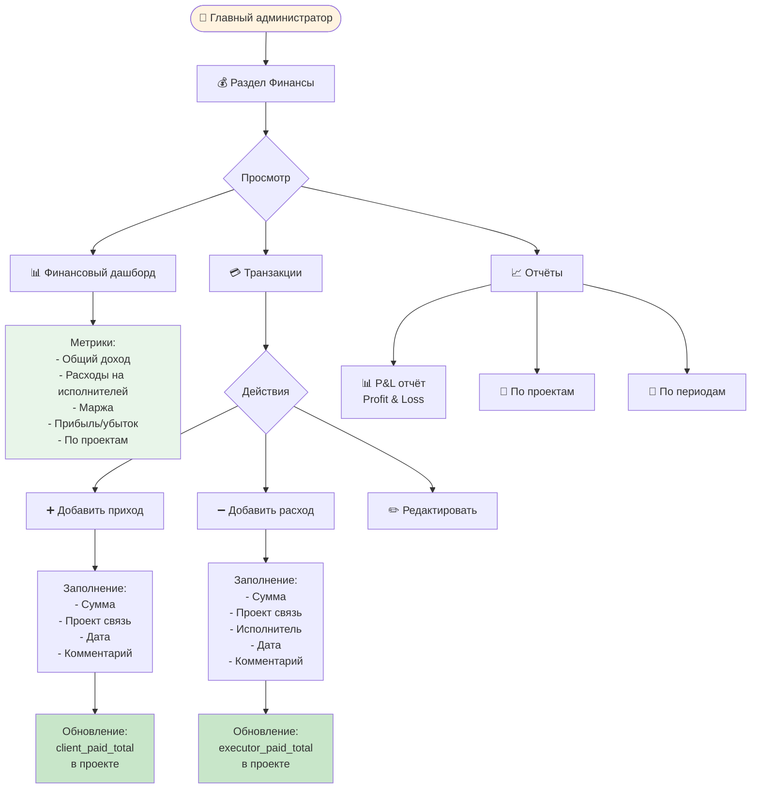

### 5. 📁 Управление портфолио и документами

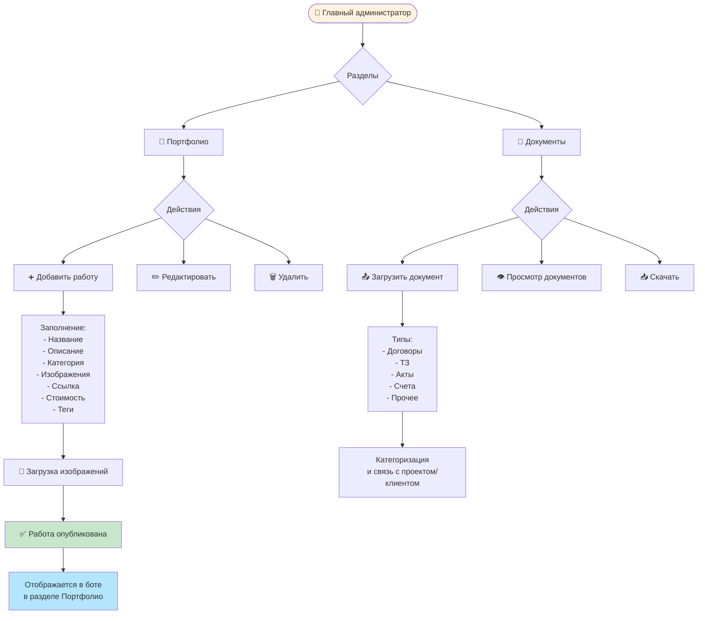

### 6. ⚙️ Настройки системы

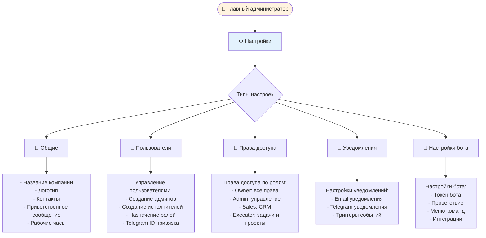

### 7. 📊 Аналитика и отчёты

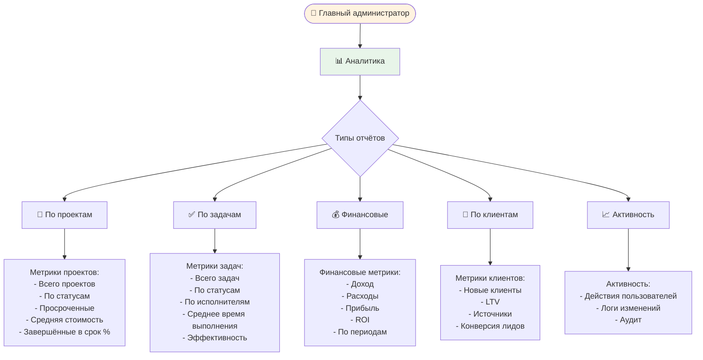

---

## Сценарии для исполнителей

### 1. ✅ Работа с задачами

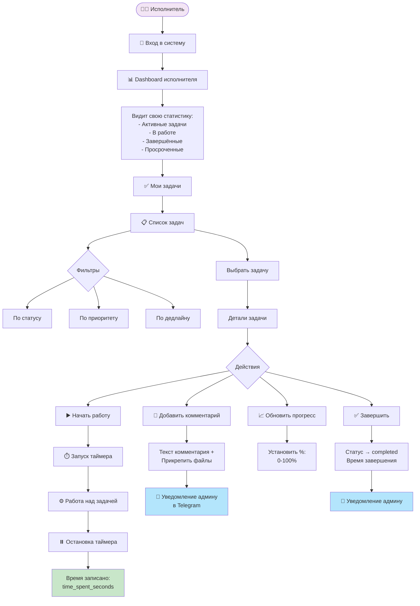

### 2. 📁 Работа с проектами

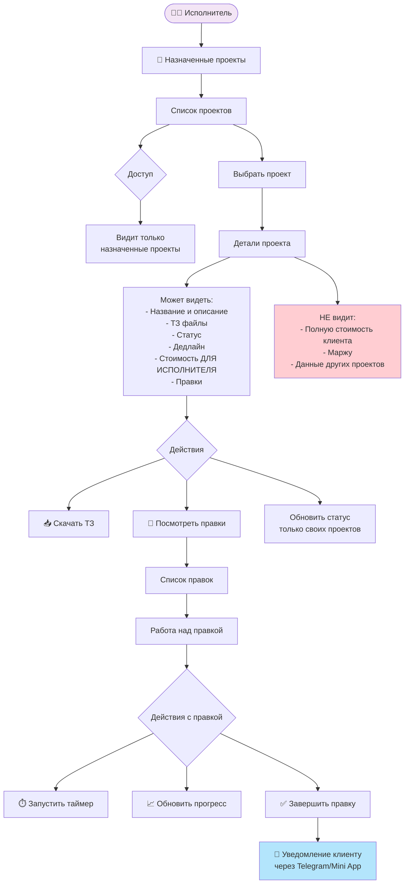

### 3. 📝 Работа с правками (Revisions)

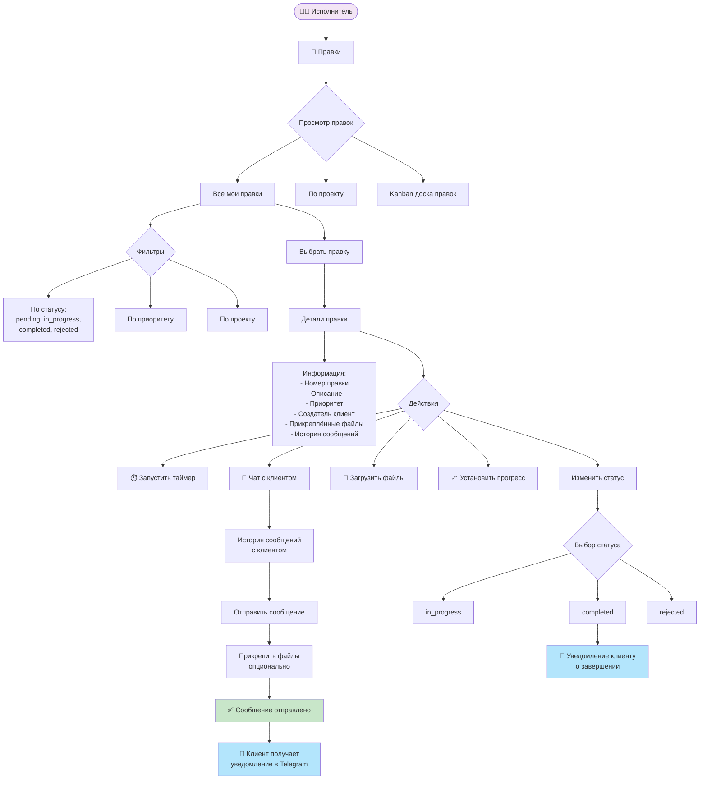

### 4. 🔔 Получение уведомлений

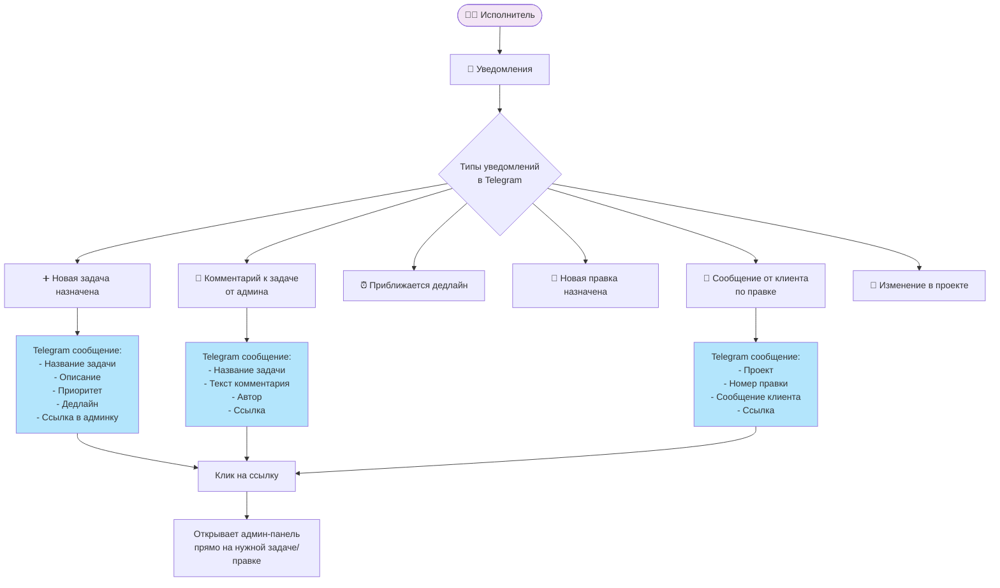

---

## Telegram Bot для клиентов

```mermaid
flowchart TD
    Start([👤 Клиент]) --> BotStart[/start в боте]
    BotStart --> MainMenu[🏠 Главное меню]

    MainMenu --> Options{Опции меню}

    Options --> CreateTZ[📝 Создать ТЗ]
    Options --> QuickReq[⚡ Быстрый запрос]
    Options --> Portfolio[🎨 Портфолио]
    Options --> Consult[💬 Консультация]
    Options --> Contacts[📞 Контакты]
    Options --> MiniApp[📱 Открыть Mini App]

    CreateTZ --> TZFlow[Диалог создания ТЗ]
    TZFlow --> Step1[1️⃣ Выбор метода:<br/>- Автоматический<br/>- Ручной]
    Step1 --> Step2[2️⃣ Выбор типа проекта:<br/>- Telegram бот<br/>- WhatsApp бот<br/>- Веб-бот<br/>- Интеграция]
    Step2 --> Step3[3️⃣ Сбор требований<br/>пошагово]
    Step3 --> TZCreated[✅ ТЗ создано<br/>и отправлено админу]

    QuickReq --> QuickFlow[Быстрый запрос]
    QuickFlow --> QStep1[1️⃣ Название проекта]
    QStep1 --> QStep2[2️⃣ Описание]
    QStep2 --> QStep3[3️⃣ Бюджет]
    QStep3 --> QStep4[4️⃣ Дедлайн]
    QStep4 --> QuickCreated[✅ Запрос отправлен<br/>админу]

    Portfolio --> PortfolioView[Просмотр работ]
    PortfolioView --> Works[Карточки работ с:<br/>- Изображениями<br/>- Описанием<br/>- Стоимостью<br/>- Ссылками]

    Consult --> ConsultStart[Запуск консультации]
    ConsultStart --> AIAssist[🤖 AI помощник<br/>помогает уточнить<br/>требования]

    Contacts --> ShowContacts[Показ контактов:<br/>- Телефон<br/>- Email<br/>- Адрес<br/>- Соцсети]

    MiniApp --> OpenMiniApp[📲 Открытие Mini App]
    OpenMiniApp --> MiniAppFeatures[Доступ к:<br/>- Проектам<br/>- Правкам<br/>- Документам<br/>- Финансам<br/>- Уведомлениям]

    style Start fill:#e1f5ff
    style TZCreated fill:#c8e6c9
    style QuickCreated fill:#c8e6c9
```

---

## Mini App для клиентов

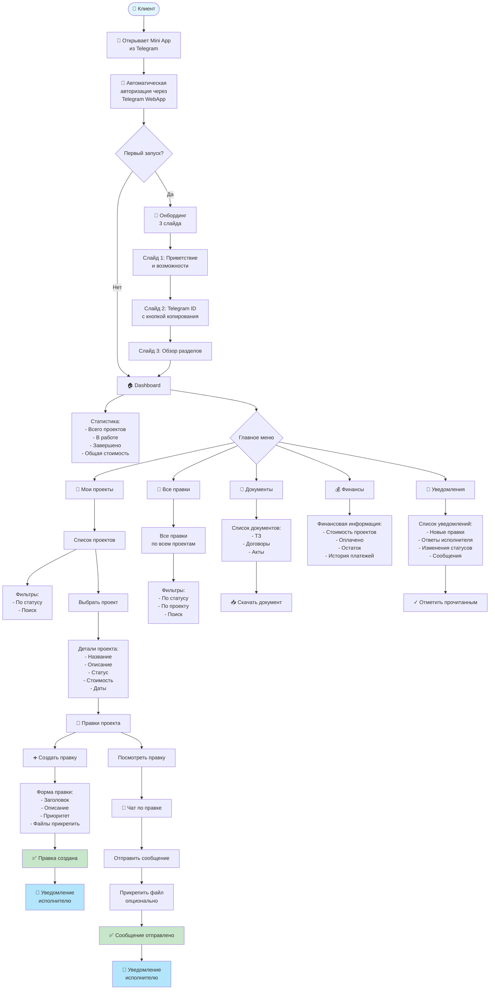

---

## Основные разделы Admin Panel

### Полный список разделов

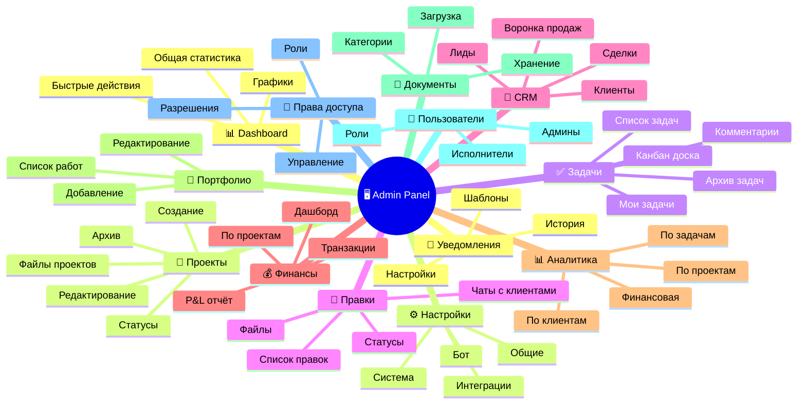

### Матрица доступа по ролям

| Раздел | Owner | Admin | Sales | Executor |
|--------|-------|-------|-------|----------|
| **Dashboard** | ✅ Полный | ✅ Полный | ✅ CRM данные | ✅ Свои данные |
| **Проекты** | ✅ Все | ✅ Все | ✅ Просмотр | ✅ Назначенные |
| **Задачи** | ✅ Все | ✅ Создание/управление | ❌ | ✅ Свои задачи |
| **Правки** | ✅ Все | ✅ Все | ❌ | ✅ Назначенные |
| **Клиенты** | ✅ Все | ✅ Все | ✅ Все | ❌ |
| **Лиды** | ✅ Все | ✅ Просмотр | ✅ Все | ❌ |
| **Сделки** | ✅ Все | ✅ Все | ✅ Все | ❌ |
| **Финансы** | ✅ Все | ✅ Просмотр | ❌ | ❌ |
| **Аналитика** | ✅ Все | ✅ Проекты/Задачи | ✅ CRM | ✅ Свои данные |
| **Портфолио** | ✅ Все | ✅ Все | ✅ Просмотр | ✅ Просмотр |
| **Документы** | ✅ Все | ✅ Все | ✅ CRM документы | ✅ По проектам |
| **Пользователи** | ✅ Все | ✅ Просмотр | ❌ | ❌ |
| **Права доступа** | ✅ Все | ❌ | ❌ | ❌ |
| **Настройки** | ✅ Все | ✅ Ограниченные | ❌ | ❌ |

---

## 🔄 Основные бизнес-процессы

### Процесс: От лида до завершённого проекта

```mermaid
flowchart LR
    Lead[📋 Лид] --> Qualify{Квалификация}
    Qualify -->|✅ Подходит| Deal[💼 Сделка]
    Qualify -->|❌ Не подходит| Archive1[📦 Архив]

    Deal --> Pipeline[📊 Движение<br/>по воронке]
    Pipeline --> Stage1[Новая]
    Stage1 --> Stage2[Переговоры]
    Stage2 --> Stage3[Согласование]
    Stage3 --> Stage4[Оплата]
    Stage4 --> Stage5[Выполнение]

    Stage5 --> Convert{Конвертация}
    Convert --> Project[📁 Проект]

    Project --> AssignExec[Назначение<br/>исполнителя]
    AssignExec --> CreateTasks[Создание<br/>задач]
    CreateTasks --> Work[⚙️ Работа]

    Work --> Revisions[📝 Правки<br/>от клиента]
    Revisions --> Fix[🔧 Исправления]
    Fix --> Testing[🧪 Тестирование]
    Testing --> Approval{Приёмка}

    Approval -->|❌ Есть правки| Revisions
    Approval -->|✅ Принято| Complete[✅ Завершение]

    Complete --> Payment[💰 Финальный<br/>платёж]
    Payment --> Archive2[📦 В архив]

    style Lead fill:#fff3e0
    style Deal fill:#e1f5ff
    style Project fill:#e8f5e9
    style Complete fill:#c8e6c9
    style Archive2 fill:#f5f5f5
```

---

## 📱 Интеграция компонентов системы

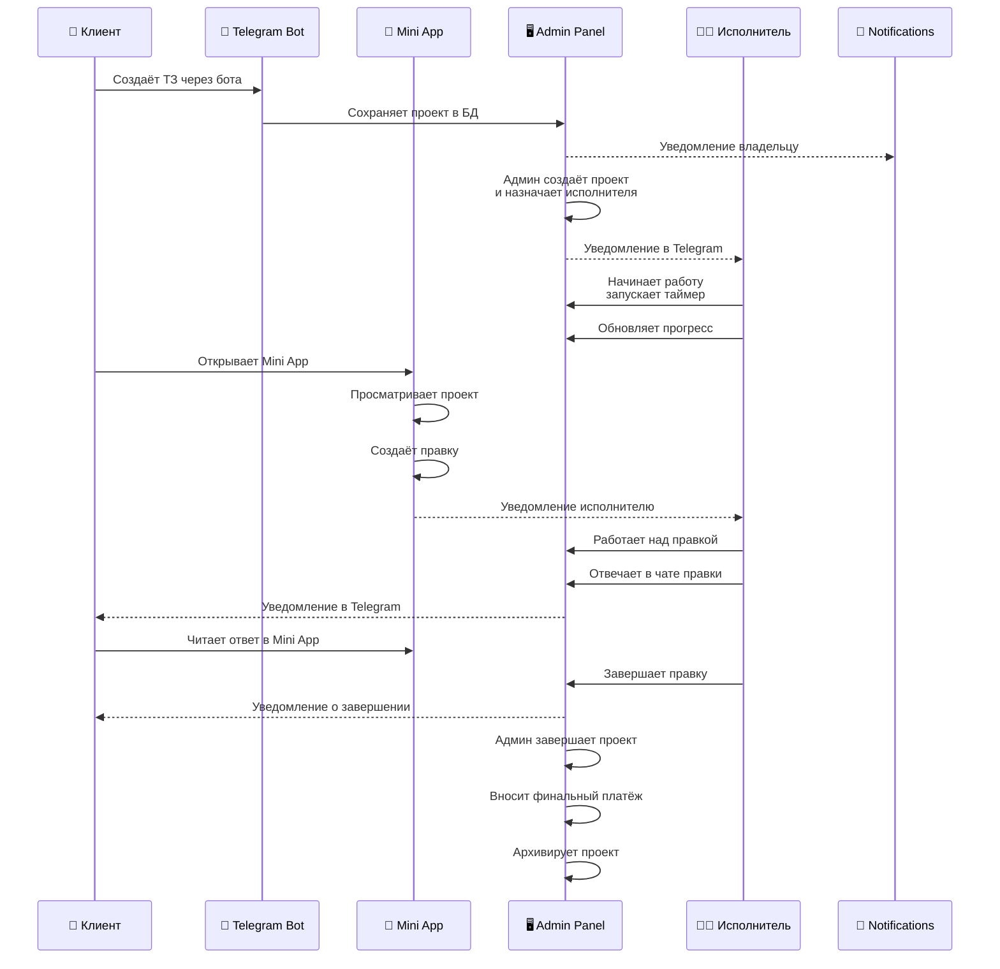

---

## 🎯 Ключевые возможности системы

### Для главного администратора (Owner)

✅ **Управление проектами**
- Создание проектов с автосозданием клиента
- Назначение исполнителей
- Загрузка ТЗ файлов
- Отслеживание статусов
- Архивация

✅ **Управление задачами**
- Создание задач для исполнителей
- Канбан доска
- Отслеживание прогресса и таймеров
- Комментарии с уведомлениями

✅ **CRM функции**
- Клиенты, лиды, сделки
- Воронка продаж
- Конвертация лидов в сделки и проекты

✅ **Финансы**
- Учёт доходов и расходов
- P&L отчёты
- Финансы по проектам
- Маржа и прибыль

✅ **Аналитика**
- Отчёты по всем разделам
- Графики и метрики
- Экспорт данных

✅ **Настройки**
- Управление пользователями
- Права доступа
- Настройки бота
- Уведомления

### Для исполнителей (Executors)

✅ **Задачи**
- Просмотр назначенных задач
- Таймер работы
- Обновление прогресса
- Комментарии

✅ **Проекты**
- Просмотр назначенных проектов
- Доступ к ТЗ и файлам
- Обновление статусов

✅ **Правки**
- Работа с правками от клиентов
- Чат с клиентом
- Прикрепление файлов
- Отслеживание времени

✅ **Уведомления**
- Telegram уведомления о новых задачах
- Уведомления о комментариях
- Сообщения от клиентов

### Для клиентов

✅ **Telegram Bot**
- Создание ТЗ
- Быстрый запрос проекта
- Просмотр портфолио
- Консультация с AI
- Доступ к Mini App

✅ **Mini App**
- Просмотр проектов
- Создание правок
- Чат с исполнителем
- Просмотр документов
- Финансовая информация
- Уведомления

---

## 🚀 Дальнейшее развитие

Этот roadmap показывает текущее состояние системы. На его основе можно:

1. **Определить недостающий функционал**
2. **Оптимизировать существующие процессы**
3. **Добавить новые возможности**
4. **Улучшить UX/UI**
5. **Расширить автоматизацию**

---

## 📞 Контакты

При возникновении вопросов по roadmap или предложений по улучшению системы обращайтесь к главному администратору.

---

**Версия документа:** 1.0
**Дата создания:** 2025-10-25
**Автор:** Claude Code Assistant
